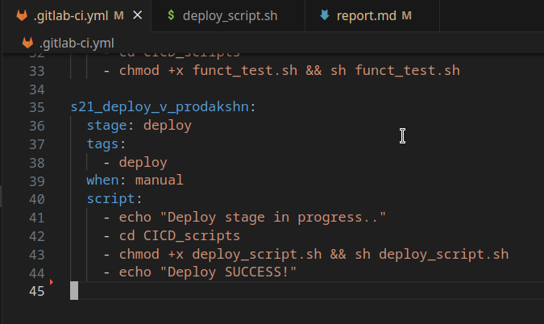

## Оглавление:

### [Преамблуа](#preamblua)
#### [Part 1 - Настройка gitlab-runner](#part-1)
#### [Part 2 - Сборка](#part-2)
#### [Part 3 - Кодстайл](#part-3)
#### [Part 4 - Интеграционные тесты](#part-4)
#### [Part 5 - Этап деплоя](#part-5)
#### [Part 6 - Уведомления](#part-6)
---
---

### Преабмлуа: что за СиАй/СиДи? CI/CD
#### **Continuous Integration and Continuous Delivery/Deployment**

- Это набор практик нацеленный на оттачивание и ускорение процесса разработки софта; используя непрерывную автоматизацию и продолжительный мониторинг сквозь всю жизнь приложения. От начала и тестовой фазы, до деплоя.

    - **CI** Continuous Integration
        - Подразумевает под собой автоматизированную и частую интеграцию изменений кода в репозиторий с исходным кодом
        - В чём плюсы? В чём выгода?
            - Такой подход позволяет находить и разбираться с багами и ошибками быстрее, что улучшает разработку во всех аспектах
    
    - **CD** Continuous Deployment
        - Относится к интеграции, тестированию, и доставки изменений в коде. 

---
- Чаще всего эти практики имплементируются через **CI/CD** пайплайн, в связке друг с другом.
- В чём суть? Зачем оно нужно ваще?
    - Оно помогает организациям избегать багов и ошибок в коде, при этом продолжая разработку и деплой своего софта
    - При увеличении приложений, пайплайн CI/CD позволяет уменьшить сложно-читаемость проекта, и ускорить разработку

---
- Алгоритм действий:
    - Разбработчик **пушит** изменения в репозиторий
    - CI/CD запускается и проверяет всё то что разработчик запушил
        - Тесты стиля
        - Тесты на утечки памяти
        - Функциональные тесты
        - И так далее~

- Главный смысл **CI/CD** в том чтобы самому не прожимать **make test** или **make valgrind** или **make clang_format**, а чтобы платформа сама произовдила все эти проверки/тесты

---

- Популярные интсруменнты используемые в CI/CD воркфлоу это 
    - **Jenkins, TeamCity, Bamboo, Concourse, GoCD, Screwdriver, Spinnaker** (впервые слышу о таких)

## Основные термины CICD
- **Раннер** - приложение которое выполняет задачи (gitlab runner в нашем случае)
    - Раннером может быть:
        - ВМ-ка на которой установлены компляторы и все нужные приложухи для проверки проекта
        - Докер образ (на ВМ-ке или вне её)
        - Сервис в интернете который предоставляет такие услуги платно
        - ПК у меня дома который стоит со включённым **gitlab-runner**'ом
        - И вообще любой другой компьютер на котором установленно и настроенно всё это дело~
    ---

- **Задачи(jobs)** - какая-либо задача которая выполняется в процессе CICD. Это может быть сборка проекта, комплияция, прогон тестов, линтер, и всё что угодно что прописал разработчик для его нужд.
    - в yml файле задачи обычно выполняют директиву **script**
    ---

- **Артефакты** - исполняемые файлы, архивы, образы контейнеров, и прочие файлы которые генерируются в ходе выполнения Задач.
    - В контексте наших учебных проектов, ярким примером артефактов будет:
        - **.out | .o** - обьектные файлы
        - **.gcda | .gcno**  - файлы которые генерируются при компиляции с gcc для **gcov_report**
        - **.info** - файл генерируемый **lcov**
        - **HTML страничка** и вся папка с ней, которая генерируется через **genhtml**

    ---

- **Этапы(stages)** - служат для группировки Задач и определения порядка их выполнения. Прописываются в конфиге. Задачи входящие в один Этап выполняются параллельно, по сему если нужно последовательное выполнение - нужно создавать Задачи в разных Этапах

---
---

### Part 1. Настройка **gitlab-runner**

##### Поднимаю виртуальную машину *Ubuntu Server 22.04 LTS*.

- Ссылка на **ISO** образ:
    - **[*UBUNTU SERVER 22.04*](https://releases.ubuntu.com/jammy/ubuntu-22.04.4-live-server-amd64.iso)** \
- 

##### Скачиваю и устанавливаю на виртуальную машину **gitlab-runner**.
- Просто взять и установить через **apt-get** не удастся, сначала нужно прожать:
    - **curl -L "https://packages.gitlab.com/install/repositories/runner/gitlab-runner/script.deb.sh" | sudo bash** \
    
    - Чтобы добавить **gitlab runner** в список скачиваемых приложений
- Затем уже прожимаем:
    - **sudo apt-get install gitlab-runner** \
    
    - **gitlab-runner** установлен

##### Запускаю **gitlab-runner** и регистриирую его для использования в текущем проекте (*DO6_CICD*).
- Их можно найти на **edu** \
    <!-- -  -->
    - 
    - Также важно было во время регистрации раннера выставить тэги. Например такие:
    - **build, test, style, deploy**
    <!--  -->

- Конфиг гитлаб-раннера выглядит так, лежит по пути:
    - **/etc/gitlab-runner/config.toml** \
    - 

- Проверяю что **gitlab-runner** работает через одну из команд:
    - **sudo gitlab-runner verify**
    - **sudo systemctl status gitlab-runner** \
    

---

### Part 2. Сборка

#### Пишу этап для **CI** по сборке приложений из проекта *C2_SimpleBashUtils*.

- Получается клонируем **SimpleBashUtils**, переходим на **develop** и копируем папки **cat** и **grep** в репозиторий нашего **CI/CD** проекта в папку **src**
- Создаём **.gitlab-ci.yml** в КОРНЕ репозитория, и прописываем в него билд стадию~
- Содержимое **.gitlab-ci.yml файла** \
    - 
    - В случае ошибок можно пройтись через **yamllint**

---

- Долго не могу понять в чём дело, потенциальные ошибки:
    - Эта ошибка выходит когда **gitlab-runner** не включён (или ВМ не включена) \
    - 
    ---
    - Эта ошибка.. по всей видимости выходит из-за того что при регистрации гитлаб-раннера я не поставил тэги, но потом пере-регистрировался с тэгами и заработало \
    - 
    ---

- С ошибками может помочь команда:
    - **gitlab-runner --debug run**
    - Или же можно использовать команду
        - **gitlab-runner --debug run > debug_output.txt 2>&1**
        - Она запустит гитлаб-раннер в дебаг режиме и отправит вывод в текстовый файл

---

- ### Зафейленный пайп выглядит так: \
- 
    - В чём могут быть траблы на этом этапе?
        - В том что не установлен **make** 
            - **sudo apt install make** 
        - В том что не установлен **gcc** 
            - **sudo apt install gcc**

---

- Успешный пайп нашего **job**: \

---

### Part 3. Тест кодстайла

#### Пишу этап для **CI**, который запускает скрипт кодстайла (*clang-format*).
- Немного переписал **.gitlab-ci.yml** файл, поменял название у цели билда и добавил директиву для стиль теста \
- 

- Первый блин комом, фейл:
    - 
    - 
    - Почему?
        - Потомучто **clang-format** не установлен~
        - **apt install clang-format**
---

##### Если кодстайл не прошел, то «фейлю» пайплайн.

- Хмм оно само фейлится если не проходит
    - 
    - 

##### В пайплайне отображаю вывод утилиты *clang-format*.
- Сделал где-то 6 пушей, с разными конфигами, переставлял цели и тэги туда сюда в **yml** файле, но оно стабильно выдает лог/трэйс только для первой **build** цели где **make** прожимается.
- Второй тест, на стиль, проходит как **passed** но трэйсов нет
- Или же при ребуте ВМки проходит, но в трэйсе пишет лишь часть от всего **script**
    -
    -
- Пробовал и через **gitlab-runner --debug run** посмотреть, ничего путного не увидел~
- Но в целом стиль проходит так что всё чики-пуки~

### Part 4. Интеграционные тесты

- Решил оформить эти три теста в виде **.sh** скриптов, для которых создал папку **CICD_scripts** \
-

- Ну и соответственно переделал **.gitlab-ci.yml** на запуск этих скриптов \
- 

> Не обязательно всё именно так оформлять, можно и в **.gitlab-ci.yml** файле всё прописать. Но просто через скрипты всё какбудто цивильнее~

#### Пишу этап для **CI**, который запускает твои интеграционные тесты из того же проекта.
- Уже скриншотил, вот этот этап:
- 

---
#### В пайплайне отображаю вывод, что интеграционные тесты успешно прошли / провалились.

- ### Весь пайплайн прошёл успешно
- 

---

- ### Билд прошёл успешно
- 
---
- ### Стиль теста прошёл успешно
- 
---
- ### Функциональные тесты прошли.. успешно?
- 
    - Странно что вывод вот так вот обрывается и нету строчки **Job succeeded**
    - Однако стадия в статусе **passed** так что всё норм навреное
    ---
    - Потом через день заработало (почему? яхз)
    - 

---
---

### Part 5. Этап деплоя

##### Поднимаю вторую виртуальную машину *Ubuntu Server 22.04 LTS*.
- По сути просто клонирую через **Oracle VM Manager** \
- 
- И в **Adapter 2** ставлю **Internal network** подобно тому как в Linux02_Network проекте
- Ну и конечно надо в yml файлах покопаться, главное чтоб эти две ВМ-ки пинговали друг-друга
    - Конфиг yml файлов нэтплана:
    - 
        - Можно так же сделать, а можно по другому. 

- Плюс **желательно** на второй ВМке удалить gitlab-runner, чтоб не было путаницы в голове~

#### Пишу этап для **CD**, который «разворачивает» проект на другой виртуальной машине.

##### Запусти этот этап **вручную** при условии, что все предыдущие этапы прошли успешно.
- Получается надо добавить условие для директивы деплоя
    - **when: manual**

##### Напиши bash-скрипт, который при помощи **ssh** и **scp** копирует файлы, полученные после сборки (артефакты), в директорию */usr/local/bin* второй виртуальной машины.
- Написал \

##### В файле _gitlab-ci.yml_ добавь этап запуска написанного скрипта.
- Добавил \

---
- Первый блин комом, опять что-то не так:
    - 
    - И как это фиксить? ммм.. видимо проблема в SSH~
---
---
---
- **Окей, получилось** \
    - 
    - 
- Каким образом?
- Получается, в этой части много запары с **ssh** и правами доступа к этой **usr/local/bin** папке. Также трабл в том что во время выполнения пайплайна, все действия происходят от имени юзера **gitlab-runner** а не от твоего юзера.
    - Сперва надо убедиться что машины друг друга видят через ping
    - **!ВАЖНО!** После этого надо на машине где **gitlab-runner** стоит перейти на **юзера** gitlab-runner:
        - **sudo su gitlab-runner**
            - Если какието траблы с доступом, то делать это с **root** юзера а не обычного
            - Пароль можно поставить/поменять через **passwd**
        - Затем надо прожать:
            - **ssh-keygen**
            - Чтобы создать ссх ключ для юзера гитлаб-руннер
        - И через команду
            - **ssh-copy-id [username]@10.10.0.2**
            - Чтобы скопировать/дать_доступ на SSH подключение через файл, избегая ввода пароля каждый раз
                >- Тут я просто прожал **history** на юзере гитлаб-раннера, чтоб показать что больше я на нём ничего не делал
                >- 
    - Также кажется надо прожать на второй ВМ-ке:
        - **sudo chmod 777 /usr/local/bin**
        - Со своей учётки, **НЕ через root** чтобы получить права на создание файлов/получение файлов в эту папку
- Ну и кажется что после этого всё будет чики-пуки

---

- Список юзаемых команд в этой части:
    - **sudo su** ; **sudo su gitlab-runner** 
        - Чтоб перейти на юзера гитлб-раннера
    - **sudo chmod 777 usr/local/bin**
        - Чтобы дать доступ на запись гитлаб-раннеру
    - **ssh-keygen**
    - **ssh-copy-id [username]@[IP-address]**
        - Копирование айди на другую машину/предоставление прав на SSH соединенеие
    - **scp file.txt [username]@[IP-address]:[path]** 
        - Чтобы копировать файл, для теста ну и в **sh** фалйе по заданию через эту комадну и делается~

---
---

### Part 6. Дополнительно. Уведомления

##### Настрой уведомления о успешном/неуспешном выполнении пайплайна через бота с именем «[твой nickname] DO6 CI/CD» в *Telegram*.

- Текст уведомления должен содержать информацию об успешности прохождения как этапа **CI**, так и этапа **CD**.
- В остальном текст уведомления может быть произвольным.
---
- Океей, пишем бота значит..
    - Создаём бота через **BotFather**
        - Находим его в Telegram, с синим значком подтверждения
        - Пишем ему
            - **/newbot**
            - **nickname DO6 CI/CD**
            - **CICD_bot**
        - В результате он выдаст нам **token API**, он нам **совершенно точно понадобится**, вид у такого токена такой:
            - > **7202394511:AAh9vuAxfysM9wsEpGj2lLHqw52wF16U8Wg**

        ---
    
    - ### Затем есть разные пути, но я сделал так:
    - Нам ещё понадобится бот **Get My ID** чтобы он показал нам ID чата
    - И затем **создаём групповой чат**,
        - Добавляем в него нашего бота **tanjaan DO6 CI/CD**
        - Также добавляем бота **Get My ID**
            - Он выдаст нам **Chat ID**, такого вида:
                - > **-4269302011**

    - После чего пишем **sh** скрипт:
        -
        - Где вставляем наш **Токен**, и **Чат АйДи**

    - Ну и добавляем директиву в **after_script** на запуск этого скрипта, **в каждой задаче**:
        - 

    - В результате бот всё пишет, сообщения передаёт~
    - 
    - 

---
    
- ### Если же намеренно зафейлить одну из стадий, например стадию стиля:
    - 
    - 

- ### То тогда телеграм бот сообщит о том что status failed
    - 

---

> P.S: Пришлось в конце на **Part 6** добавлять условие на успех/фейл в **gitlab-ci.yml** на запуск скриптов. 
>    - Пока не прописал такое вот условие, тесты в любом случае считались Success~
>    

### EOF